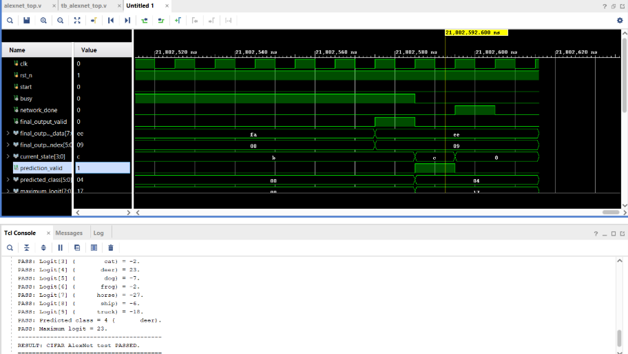
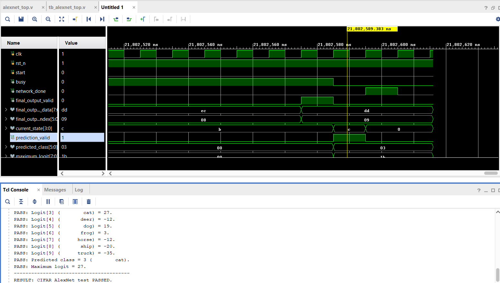
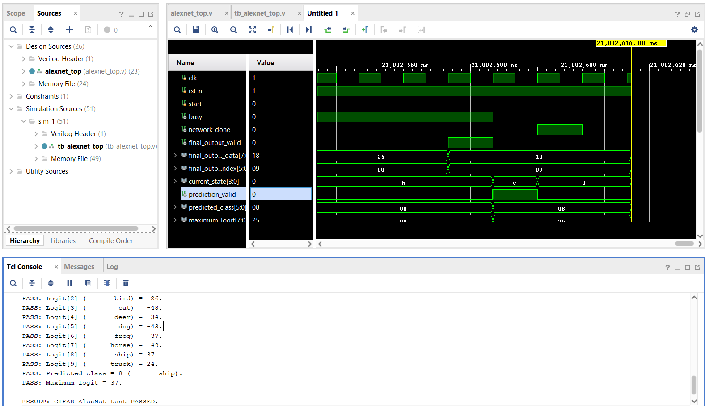

<center>

# ALEXNET with CIFAR-10

</center>

## I. Overview 
Convolutional neural networks are commonly used for image recognition and classification. Although neural-network models are normally developed and executed using software frameworks such as PyTorch, their inference operations can also be implemented directly in digital hardware.

The purpose of this project was to develop and verify a compact, hardware-friendly CNN accelerator inspired by AlexNet, implemented in Verilog. Unlike the original AlexNet, the network was redesigned with fewer layers and smaller channel counts to fit FPGA resource constraints. The accelerator was designed to classify 32×32 RGB images from a selected subset of the CIFAR-10 dataset.


## II. Architecture
### 2.1 Function 
The accelerator receives a signed INT8 representation of a 32×32 RGB image and performs a complete forward pass of the quantized CNN entirely in hardware. The network processes the image through five convolutional layers (each followed by ReLU), three max-pooling layers interleaved after the first, second, and fifth convolutions, and three fully connected layers. The final fully connected layer produces ten signed classification logits, one for each of the ten CIFAR-10 classes. An Argmax module then compares all ten logits and outputs the index of the largest one as the predicted class.

```
32 × 32 × 3 INT8 image
        ↓
Conv1 → Pool1 → Conv2 → Pool2 → Conv3 → Conv4 → Conv5 → Pool5
        ↓
FC6 → FC7 → FC8
        ↓
Ten classification logits
        ↓
      Argmax
        ↓
Predicted class (one of ten CIFAR-10 classes)
```
Each convolution and fully connected layer includes an integer requantization step, which rescales the 32-bit MAC accumulator back down to signed INT8 using a fixed-point multiplier and shift, matching the scale factors computed during quantization in Python.

The accelerator performs inference only. Training and quantization are carried out separately in PyTorch on the full 10-class CIFAR-10 dataset, and the resulting weights, biases, and requantization parameters are exported and loaded into the RTL design's memories before simulation.


### 2.2 Hierarchy vivado design
```
alexnet_top (alexnet_top.v)
│
├── controller_inst : network_controller (network_controller.v)
│
├── conv1_inst : conv_engine (conv_engine.v)
│   ├── loop_ctrl_inst    : conv_controller (conv_controller.v)
│   ├── addr_gen_inst     : conv_address_generator (conv_address_generator.v)
│   ├── activation_rom_inst : conv_activation_rom (conv_activation_rom.v)
│   ├── weight_rom_inst   : conv_weight_rom (conv_weight_rom.v)
│   ├── bias_rom_inst     : conv_bias_rom (conv_bias_rom.v)
│   └── datapath_inst     : conv_datapath (conv_datapath.v)
│       └── requantize_inst : fixed_point_requantize (fixed_point_requantize.v)
├── conv1_pool1_buffer : activation_buffer (activation_buffer.v)
│
├── pool1_inst : pool_engine (pool_engine.v)
│   ├── loop_ctrl_inst : pool_controller (pool_controller.v)
│   ├── addr_gen_inst  : pool_address_generator (pool_address_generator.v)
│   └── datapath_inst  : pool_datapath (pool_datapath.v)
├── pool1_conv2_buffer : activation_buffer
│
├── conv2_inst : conv_engine  
├── conv2_pool2_buffer : activation_buffer
│
├── pool2_inst : pool_engine 
├── pool2_conv3_buffer : activation_buffer
│
├── conv3_inst : conv_engine
├── conv3_conv4_buffer : activation_buffer
│
├── conv4_inst : conv_engine
├── conv4_conv5_buffer : activation_buffer
│
├── conv5_inst : conv_engine
├── conv5_pool5_buffer : activation_buffer
│
├── pool5_inst : pool_engine
├── pool5_fc6_buffer : activation_buffer
│
├── fc6_inst : fc_engine (fc_engine.v)
│   ├── loop_ctrl_inst  : fc_controller (fc_controller.v)
│   ├── addr_gen_inst   : fc_address_generator (fc_address_generator.v)
│   ├── weight_rom_inst : conv_weight_rom
│   ├── bias_rom_inst   : conv_bias_rom    
│   └── datapath_inst   : fc_datapath (fc_datapath.v)
│       └── requantize_inst : fixed_point_requantize
├── fc6_fc7_buffer : activation_buffer
│
├── fc7_inst : fc_engine  
├── fc7_fc8_buffer : activation_buffer
│
├── fc8_inst : fc_engine 
│
└── argmax_inst : argmax_engine (argmax_engine.v)
```

### 2.3 Neural networking
| Layer | Configuration | Output Size |
|---|---|---|
| Input  | RGB image | 32 x 32 x 3 |
| Conv1 | 3-8, 5x5 kernel, stride 1, padding 2 | 32 x 32 x 8 |
| Pool1 | 2x2 window, stride 2 | 16 x 16 x 8 |
| Conv2 | 8-16, 3x3 kernel, stride 1, padding 1 | 16 x 16 x 16 |
| Pool2 | 2x2 window, stride 2 | 8 × 8 × 16 |
| Conv3 | 16→32, 3×3 kernel, stride 1, padding 1 | 8 x 8 x 32 |
| Conv4 | 32→32, 3×3 kernel, stride 1, padding 1 | 8 × 8 × 32 |
| Conv5 | 32→16, 3×3 kernel, stride 1, padding 1 | 8 × 8 × 16 |
| Pool5 | 2×2 window, stride 2 | 4 × 4 × 16 |
| Flatten | 4 × 4 × 16 | 256 |
| FC6 | 256→64 | 64 |
| FC7 | 64→32 | 32 |
| FC8 | 32→10 | 10 |
| Argmax | Select maximum logit | Predicted class |


### 2.4 Numerical representation
| Value | Representation |
|---|---|
| Input activations | Signed INT8 |
| Intermediate activations | Signed INT8 |
| Weights | Signed INT8 |
| Biases | Signed INT32 |
| Accumulators | Signed INT32 |
| Requantization multiplier | Signed INT32 |
| FC8 logits | Signed INT8 |

### 2.5 Convolutional layers

- Conv1: 3 → 8 channels
- Conv2: 8 → 16 channels
- Conv3: 16 → 32 channels
- Conv4: 32 → 32 channels
- Conv5: 32 → 16 channels

### 2.6 Fully Connected layers

- FC6: 256 → 64
- FC7: 64 → 32
- FC8: 32 → 10

ReLU activation is used after each convolutional and hidden
fully-connected layer.

### 2.7 Activation buffers

| Connection | Buffer depth |
|---|---:|
| Conv1 → Pool1 | 8192 |
| Pool1 → Conv2 | 2048 |
| Conv2 → Pool2 | 4096 |
| Pool2 → Conv3 | 1024 |
| Conv3 → Conv4 | 2048 |
| Conv4 → Conv5 | 2048 |
| Conv5 → Pool5 | 1024 |
| Pool5 → FC6 | 256 |
| FC6 → FC7 | 64 |
| FC7 → FC8 | 32 |

### 2.8 Argmax 
FC8 generates five logits:
```
logit[0] = airplane score 
...
logit[9] = truck score 
```

The Argmax engine compares the signed logits and outputs:

Predicted class index
Maximum logit


## III. Conclusion 
This project presented the design and RTL implementation of a quantized CNN accelerator for CIFAR-10 image classification. The neural network was converted from a floating-point model into an INT8 fixed-point representation, with INT32 used for biases and accumulators. The quantized parameters were then exported and integrated into the hardware architecture for FPGA-oriented implementation.

The accelerator was organized into convolution, pooling, fully connected, flatten, activation, and argmax stages. Dedicated buffers were used between processing stages to store intermediate feature maps and transfer data efficiently. The design also adopted sequential computation and reusable arithmetic resources to reduce hardware resource usage while maintaining a clear and modular RTL structure.

## IV. Waveform 
Test simulation for input image:



**PASSED** ✅



**PASSED** ✅



**PASSED** ✅

## V. Implementation 
Detail code here: [AlexNet_Verilog_Cifar10](https://github.com/LocPC2102/AlexNet_Verilog_Cifar10/tree/main/AlexNet_cnn)


